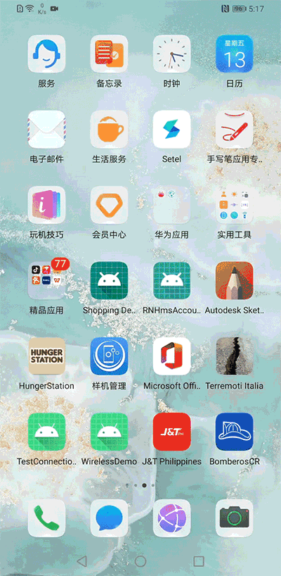
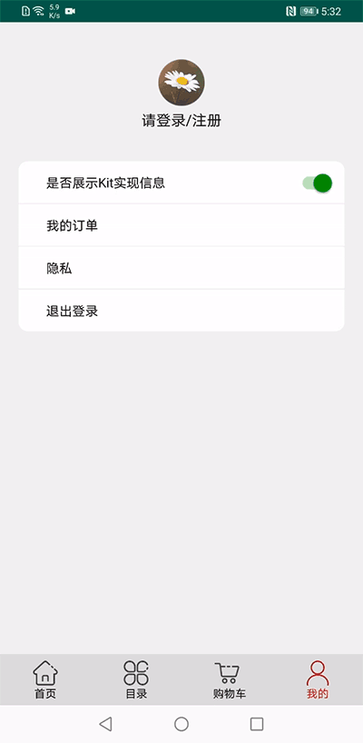
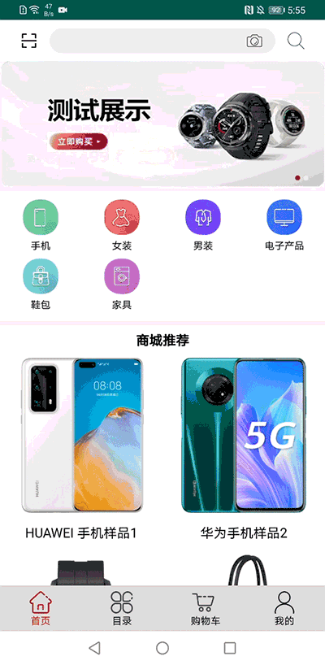
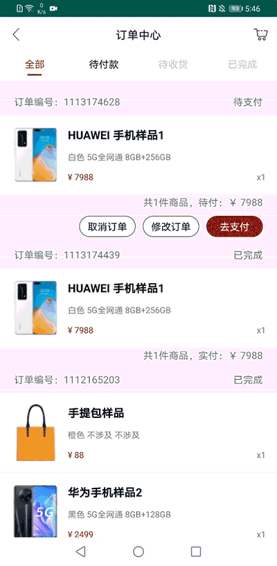
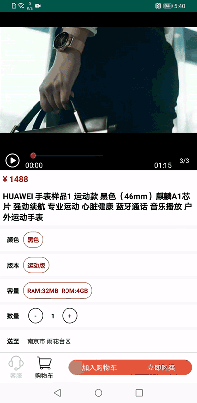
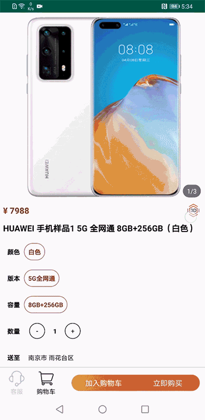

# HMS E-commerce Demo

## Description
HMS Core Offers an innovative solution that assists e-commerce apps with quick customer acquisition and improved conversion rates, for sustainable business growth.

This project contains the shopping demo app based on HMS Core Kits. It shows how to use the HMS Core solution in shopping app. It provides the demo of the whole shopping process except payment.

## Demo Link
Demo website: https://developer.huawei.com/consumer/en/solution/hms/ecommerce

Firstly choose the area you are in, then you can download the Demo App from scanning the corresponding QR code.

<table><tr>
<td>

China

</td>
<td>

Asia, Africa, and Latin America

</td>
<td>

Europe

</td>
<td>

Russia

</td>
</tr></table>

## Features
Features of this application with HMS Core solution
- Product list page
- Product detail page
- Picture/video/3D product showcase
- Ads placement
- Filter by category
- Barcode scanning-based search
- Photo scanning-based search
- Search by product name
- Add/update to shopping cart
- One-tap login in/out
- Notifications for order/payment update
- User location/location filling

## Application Generation
**Environment Requirement**:

- Android Studio: 4.1
- Android SDK: 19
- Gradle: 6.3

**Run locally**
1. Clone the repository:
     
        git clone https://github.com/HMS-Core/hms-ecommerce-demo.git

You can also download the zip file containing the code in this page

2. Copy jks file and agconnect-services.json to app folder.

3. Update jks file information in app/build.gradle file.

4. Build the application from the command line:

        cd hms-ecommerce-demo
        gradle clean
        gradle build

## Kit Usage Description
- When opening the App, Ads kit will be called to show the splash Ads.

- When you log in your Huawei Account, the account kit will used.

- Scan kit is used to scan the barcode/QR Code to view the product.

You can use the following barcode picture to test barcode buy function:

- You can also take a photo to the physical goods and system will search for the similar item in the system. ML kit capability is used here.

- After you create a purchase order, a notification will be sent to you via push kit.

- When you view the product information, video kit is used to show the product video.

- Location kit is used to get your current location to get the district information.
- Identity kit is used to get configured address to make it fast for delivery address.
- Analytics Kit will collect the basic usage information to App developer to analyze the App usage statistics.

- Scene Kit can show the 3D model of the product.

## Precautions
The Shopping Demo is a Demo app which simulate a shopping process. There are limited products in the App. Some functions are unavailable or virtual service.

- Customer Service is unavailable.
- It is virtual payment in the App. There will be no deduction from anywhere.
- The product in the App is virtual. 
- The order you made in the App is virtual, there will not be product delivery.
- The Ads in the App is test Ads.
- The account you login is the Huawei Account on the phone. The App will get your avatar and account name. It is used to show in the App.

## Participation
If you want to evaluate more about HMS Core, [HMSCore on Reddit](https://www.reddit.com/r/HuaweiDevelopers/) is for you to keep up with latest news about HMS Core, and to exchange insights with other developers.

If you have questions about how to use HMS samples, try the following options:
- [Stack Overflow](https://stackoverflow.com/questions/tagged/huawei-mobile-services) is the best place for any programming questions. Be sure to tag your question with 
`huawei-mobile-services`.
- [Huawei Developer Forum](https://forums.developer.huawei.com/forumPortal/en/home?fid=0101187876626530001) HMS Core Module is great for general questions, or seeking recommendations and opinions.

If you run into a bug in our samples, please submit an [issue](https://github.com/HMS-Core/hms-ecommerce-demo/issues) to the Repository. Even better you can submit a [Pull Request](https://github.com/HMS-Core/hms-ecommerce-demo/pulls) with a fix.

## Licensing and Terms
HMS Shopping Demo is licensed under the [Apache 2.0 license](https://github.com/HMS-Core/hms-ecommerce-demo/blob/main/LICENSE).

