中文 | [English](README.md)

# HMS E-commerce Demo

## 描述
HMS Core提供了电商类购物App的集成方案，以协助开发者快速获取客户，提升转化率，实现业务的可持续增长。

该项目提供了基于HMS Core相关Kit的购物App的Demo，演示了在购物类App中如何使用HMS Core方案。该Demo包含了除支付之外，完整的购物流程。

## Demo下载链接
[Demo网站](https://developer.huawei.com/consumer/cn/solution/hms/ecommerce?ha_source=hms7)

选择适当的区域，使用浏览器扫描对应的二维码，便可以下载Demo应用。

<table><tr>
<td>

中国

</td>
<td>

亚非拉

</td>
<td>

欧洲

</td>
<td>

俄罗斯

</td>
</tr></table>

## 特性
应用以下页面中使用到HMS Core的特性
- 商品列表页面
- 商品详情页面
- 商品收藏/购物车
- 图片/视频/3D产品展示
- 条形码扫描搜索
- 产品图片搜索/语音搜索
- 扫码支付/二维码生成
- 一键登录登出
- 产品订单提醒推送
- 用户位置信息获取
- 用户地址获取
- 会员功能
- 系统完整性检查
- 用户评价功能，并可以进行自动翻译
- AR试戴
- 银行卡识别
- 地理围栏
- 智能客服
- 积分功能
- 线下门店引导
- 优惠价营销
- 产品分享

## 应用生成
**编译环境**:

- Android Studio: 4.1
- Android SDK: 19
- Gradle: 6.3

**本地运行**
1. 克隆代码仓:
  
        git clone https://github.com/HMS-Core/hms-ecommerce-demo.git

您也可以下载包含该项目的Zip包。

2. 将您的jks文件和agconnect-services.json文件拷贝到app目录。关于jks和agconnect-services.json的生成可以参考：[配置AppGallery Connect](https://developer.huawei.com/consumer/cn/doc/development/HMSCore-Guides/config-agc-0000001050196065?ha_source=hms7)

3. 在app/build.gradle文件中更新您的jks文件信息及Application ID。

4. 在命令行中编译应用程序：

        cd hms-ecommerce-demo
        gradle clean
        gradle build

## Kit使用描述
- Account Kit将帮助您直接使用Huawei帐号进行登录。

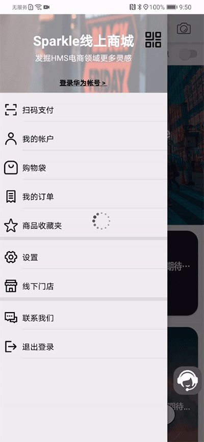

- Scan kit可以进行条形码/二维码扫描，进行产品查看、扫码支付，并可以生成二维码

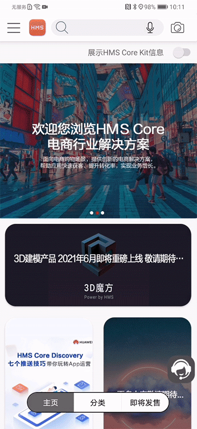

您可以使用下面的条形码，测试条形码购买的功能：

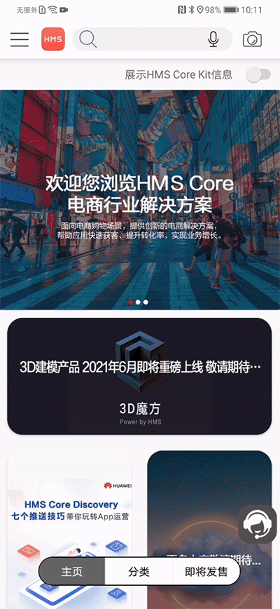

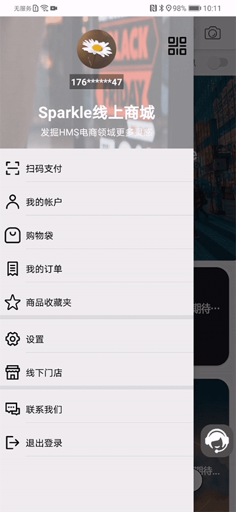

- 您可以通过给物品拍照，由ML Kit帮您在系统中搜索相似的商品。

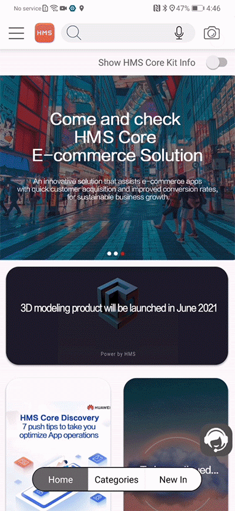

- 当您下单之后，Push Kit将收到向您推送的相关通知。

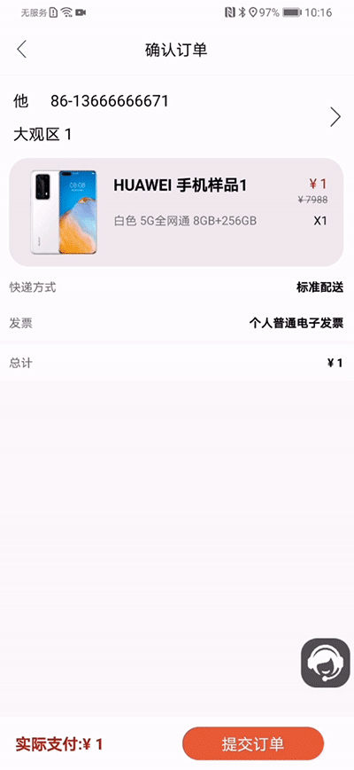

- 当您查看商品信息时，Video Kit将向您展示商品的相关视频。

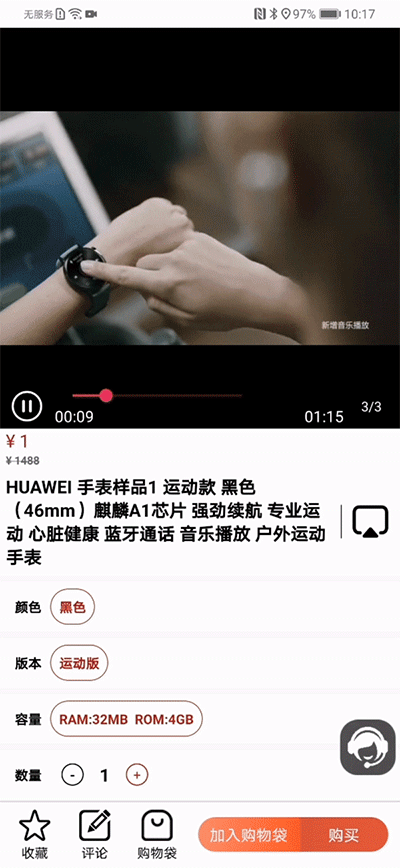

- Location kit可以获取您当前的位置信息，并从其中获得您所在的地区信息。并且可以提供地理围栏功能，当用户进出指定范围时可以收到提醒。

  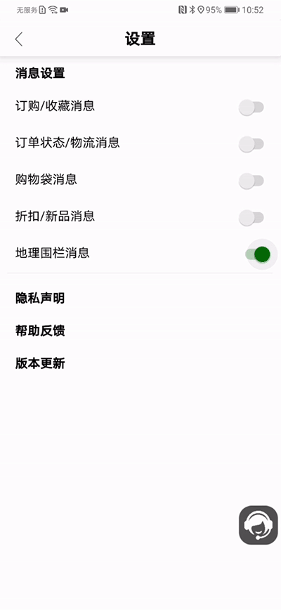

- Identity kit可以获取用户已配置的地址信息，已快速进行快递地址填写。
- Analytics Kit可以获取当前App使用的基本信息，以分析统计App的使用数据，供开发者进行优化。

- Scene Kit可以进行商品的3D展示。

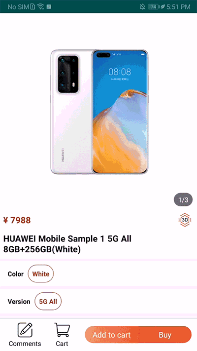

- IAP Kit可以帮助进行会员关系的订购，以提供会员优惠。

- Safety Detect可以在启动时检查系统完整性，以保证运行环境安全。

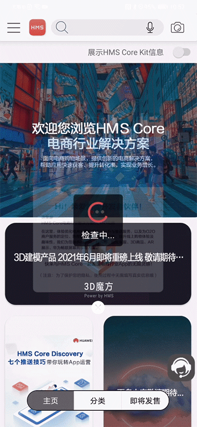

- ML Kit可以提供评论翻译，银行卡识别，语音搜索等功能

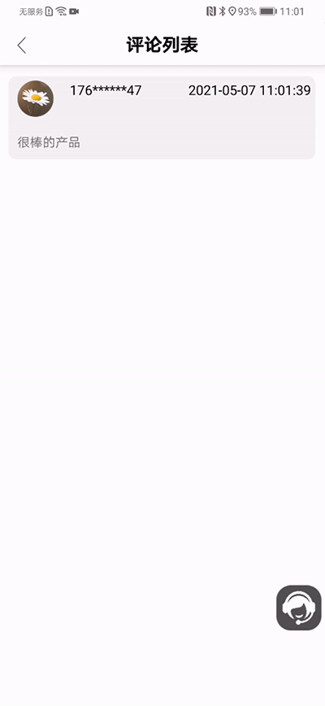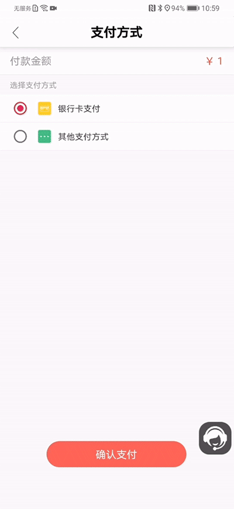

- AR Kit可以提供商品试穿试戴的功能，如眼镜试戴。

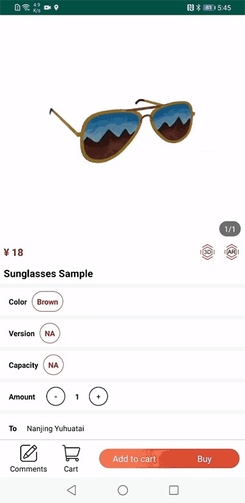

- Map/Location Kit可以展示线下门店信息并生成导航路径

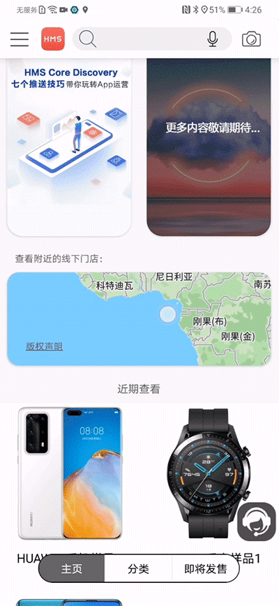

- Search Kit可以提供智能客服功能，通过机器人对话的方式自动回复用户问题

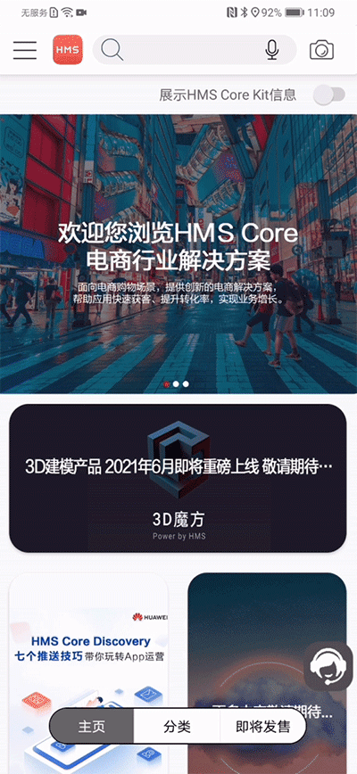

- 集成CaaS Kit能力，用户可以借助畅连功能在购物过程中进行屏幕共享。在商品浏览界面使用分享按钮进行界面共享启动。 
- 集成Crash Kit能力可以记录统计应用崩溃信息。
- 收藏商品：用户可以将喜爱的商品添加至收藏夹，并单独展示在商品收藏页面。
- 产品优惠价：所有商品价格均展示原价与优惠价两个价格，优惠价突出展示。
- 产品上新：新产品单独展示页面，优惠倒计时显示折扣活动剩余时间，用户可选择订阅商品，并触发推送消息
- 会员积分：当用户购买商品时，根据用户购买的商品金额，在账户中增加积分。
- 商品链接分享：当用户查看商品时，可将该商品通过链接的方式，在社交软件中进行分享，包括但不限于支付宝，微信，facebook等。

## 注意事项
购物App Demo是模拟真实购物流程的演示。因此其中商品数量是有限的，部分功能是不具备的，部分功能是虚拟的。

- 商品购买的功能为虚拟购买，不会进行实际扣费。
- App中的会员订购为真实订购，将会从您的帐户中进行实际扣费，并且不会退费。
- 会员订购完成后请及时通过“订阅管理”取消订购，否则将会导致持续扣费。取消订购后当前会员关系将保持到周期结束。
- App中的商品为虚拟商品。
- App中的订单为虚拟订单，不会有实际购买和实际送货。
- App中的广告为测试广告。
- App中登录的帐户为手机中的华为帐号。App将获取帐号中的头像及帐号名用于App中的展示。

## 参与
如果您想更多的了解HMS Core，欢迎您来到[HMSCore on Reddit](https://www.reddit.com/r/HuaweiDevelopers/) 获取最新的HMS Core的信息，并且和更多的开发者一起进行交流。

如果对使用该样例项目仍然存在疑问，欢迎通过以下渠道告诉我们：
- 建议在[Stack Overflow](https://stackoverflow.com/questions/tagged/huawei-mobile-services?tab=Votes) 中反映开发编程中的问题。请给您的问题打上 `huawei-mobile-services`的标签。
- 建议在[Huawei开发者论坛](https://developer.huawei.com/consumer/cn/forum/block/hms-core?ha_source=hms1) HMS Core办款中反馈其他问题，或者搜索相关建议和意见。

如果您在样例工程中发现Bug，欢迎您在 [issue](https://github.com/HMS-Core/hms-ecommerce-demo/issues) 中反馈给我们。同时欢迎您直接提交进行修改[Pull Request](https://github.com/HMS-Core/hms-ecommerce-demo/pulls) 。

## Licensing and Terms
HMS购物Demo使用 [Apache 2.0 license](https://github.com/HMS-Core/hms-ecommerce-demo/blob/main/LICENSE).

